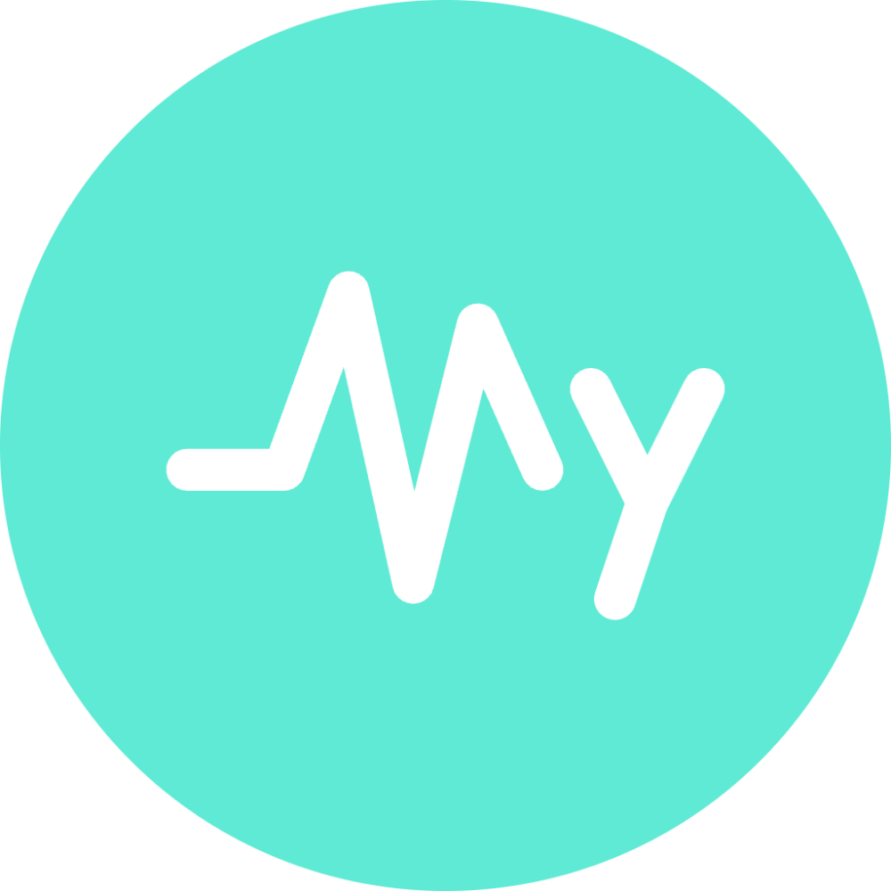

<div align="center">



# MyClínica

### Sistema de Gestão para Clínicas e Consultórios

**Prontuário eletrônico · Agenda · Financeiro · CRM via WhatsApp com IA**

[](https://nextjs.org/)
[](https://www.typescriptlang.org/)
[](https://easypanel.io/)

[🌐 Acessar o site](https://site.myclinica.online) · [🚀 Criar conta grátis](https://myclinica.online/login?mode=register) · [💬 Falar no WhatsApp](https://wa.me/5588988557247)

---

</div>

## ✨ Sobre o Projeto

A **MyClínica** é uma plataforma SaaS completa para gestão de clínicas e consultórios. Esta landing page apresenta o produto, suas funcionalidades e planos de assinatura.

> 7 dias grátis · Sem cartão de crédito · 7 especialidades suportadas

## 📸 Preview


## 🗂 Seções da Landing Page

| # | Seção | Descrição |
|---|---|---|
| 1 | **Hero** | Headline principal, CTAs e estatísticas |
| 2 | **Features** | Funcionalidades principais do produto |
| 3 | **Specialties** | Prontuário personalizado por especialidade (7 áreas) |
| 4 | **Preview** | Demo interativa da interface do SaaS |
| 5 | **Plans** | Planos e preços |
| 6 | **Contact** | CTA final via WhatsApp |

## 🏥 Especialidades Suportadas

🦷 Odontologia · 🩺 Medicina · ✨ Estética · 🐾 Veterinária · 🤸 Fisioterapia · 🧠 Psicologia · 🥗 Nutrição

## 🛠 Stack

- **Framework:** Next.js 16 (App Router)
- **Linguagem:** TypeScript
- **Estilos:** CSS Modules
- **Fontes:** Geist + Instrument Serif (via `next/font`)
- **Deploy:** Docker standalone no EasyPanel

## 🚀 Rodando Localmente

```bash
# Clone o repositório
git clone https://github.com/dimitresouza12/myclinica-landing.git
cd myclinica-landing

# Instale as dependências
npm install

# Inicie o servidor de desenvolvimento
npm run dev
```

Acesse [http://localhost:3000](http://localhost:3000)

## 📦 Build de Produção

```bash
npm run build
npm start
```

O projeto usa `output: 'standalone'` para gerar uma imagem Docker otimizada.

## 🌐 Deploy

O deploy é feito via **EasyPanel** com Docker. Após cada push na branch `main`, basta acionar o redeploy no painel.

---

<div align="center">

Feito com ❤️ para clínicas brasileiras · [myclinica.online](https://myclinica.online)

</div>
